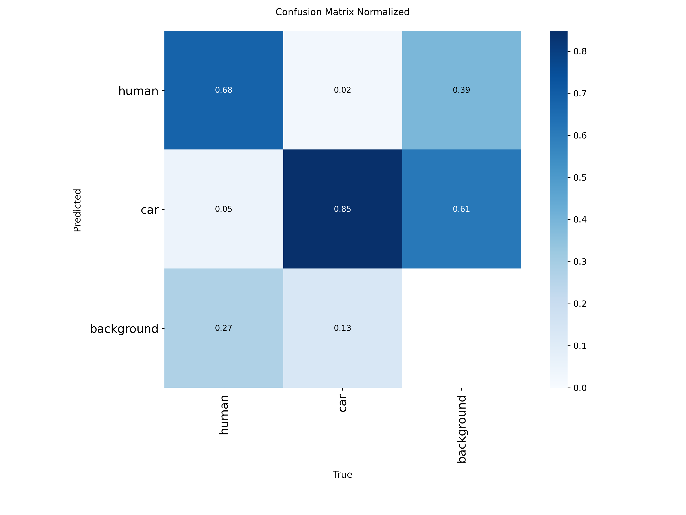
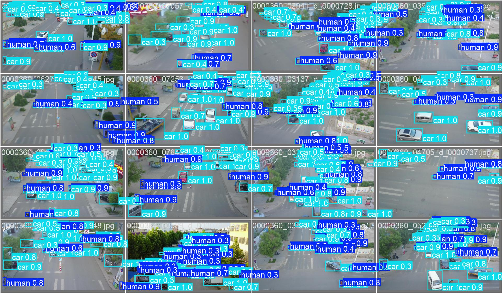
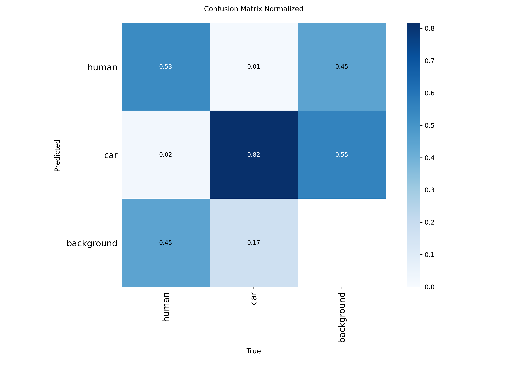
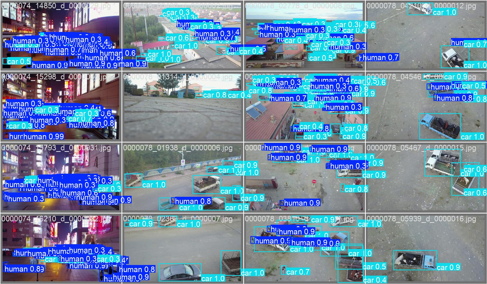
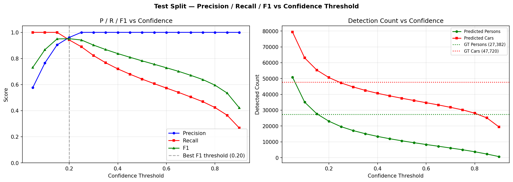
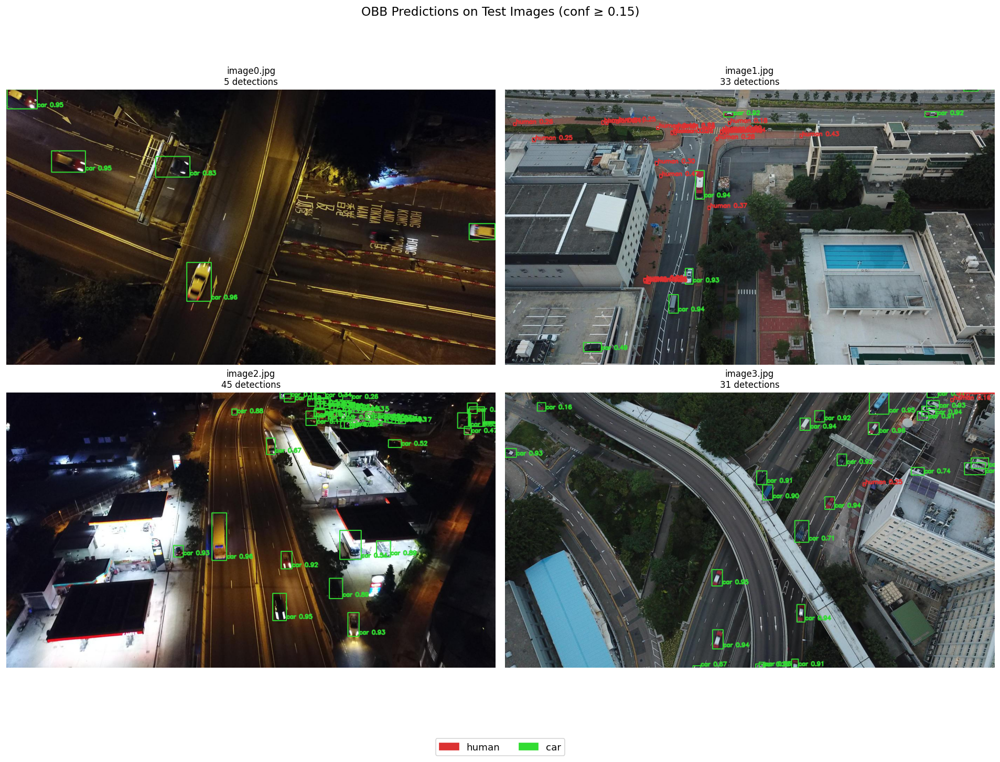
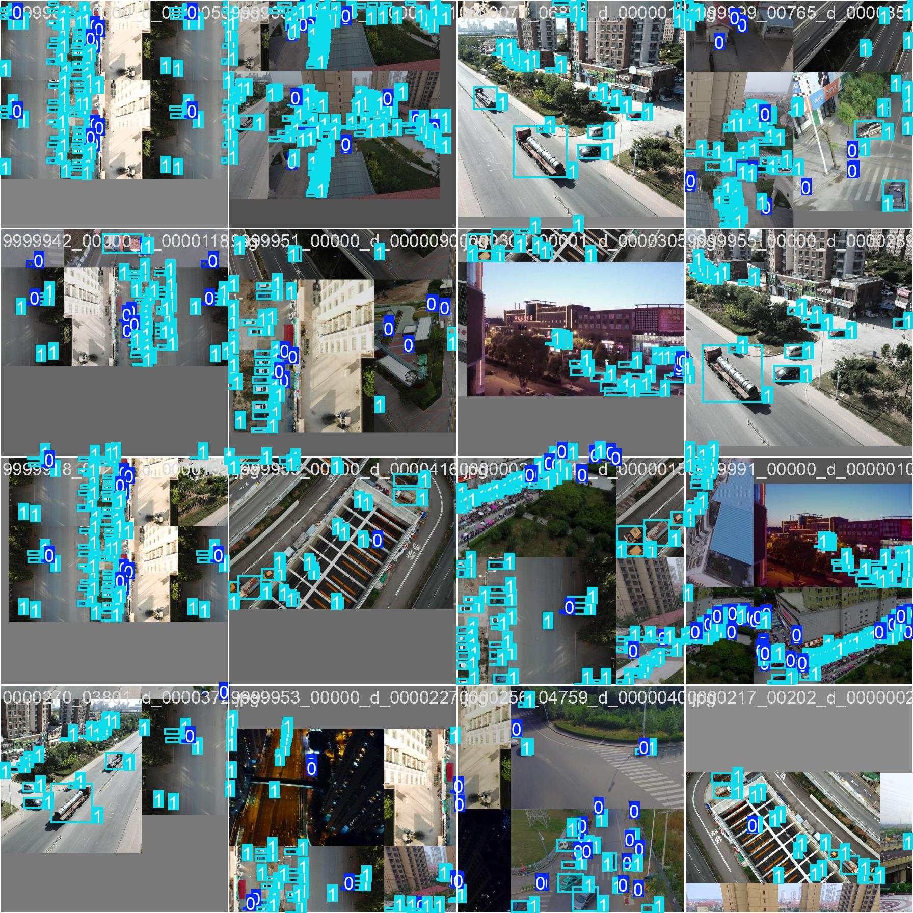
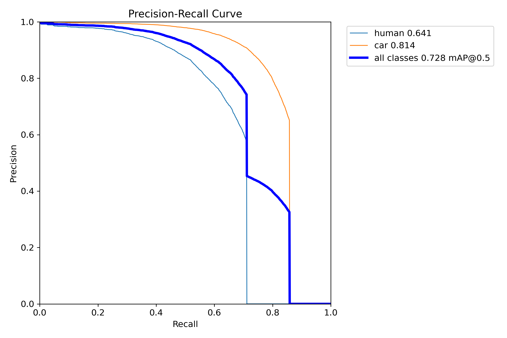
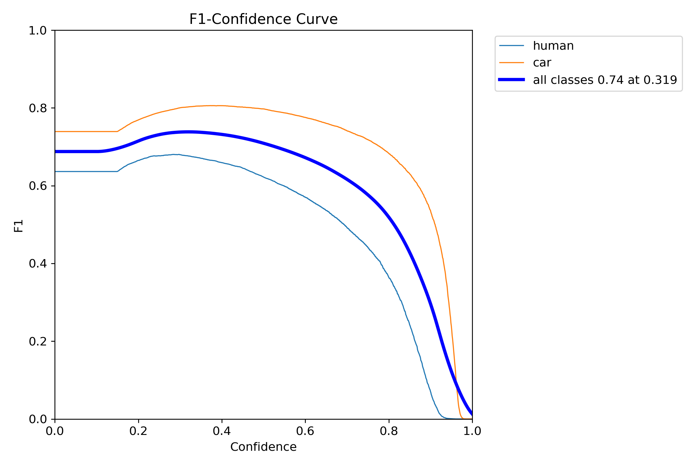
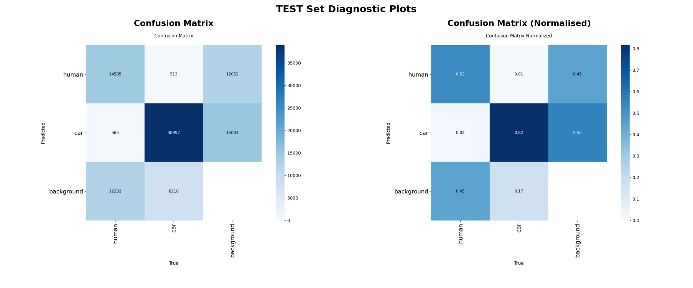

# 🚁 Drone Human Detection & Counting System

An end-to-end computer vision pipeline for **aerial/drone imagery** that detects **humans** and **cars**, counts people in images and videos, and visualizes results with oriented bounding boxes (OBB) using the **VisDrone** dataset and **Ultralytics YOLO26-OBB**.

---

## 📌 Short Introduction

Drone-based surveillance and crowd monitoring require reliable detection of people and vehicles from high-altitude, wide-field-of-view cameras. Small object size, dense scenes, occlusion, and camera motion make this problem significantly harder than standard ground-level detection.

This project delivers a complete workflow—from **dataset exploration and label engineering** through **model training and rigorous evaluation** to **single-image, batch, and video inference** with **BoT-SORT multi-object tracking** for unique person counting across frames. The primary model is **YOLO26l-OBB**, fine-tuned on a curated two-class subset of VisDrone (`human`, `car`) with oriented boxes to better fit objects viewed from above.

---

## 🎯 Project Objectives

| Objective | Description |
|-----------|-------------|
| **Detect** | Identify humans and cars in drone/aerial images using a fine-tuned object detector |
| **Count** | Report per-image and per-video human counts |
| **Visualize** | Render OBB predictions, class labels, confidence scores, and on-frame count panels |
| **Evaluate** | Measure detection quality with standard detection metrics (mAP, precision, recall, confusion matrices) |
| **Track** | Associate person detections over time with **BoT-SORT** for unique whole-video people counts |
| **Document** | Provide reproducible notebooks, YAML configs, and evaluation artifacts for academic/portfolio review |

---

## ✨ Features

- **VisDrone integration** — Official DET train/val/test-dev splits with 10→2 class consolidation  
- **Oriented bounding boxes (OBB)** — HBB→OBB conversion for rotated/aerial object alignment  
- **Exploratory data analysis** — Split statistics, resolution/bbox distributions, class balance, anchor analysis  
- **YOLO26-OBB training** — Primary `yolo26l-obb` run
- **YAML-driven configuration** — Centralized dataset (`ds_config.yaml`) and training (`train_config.yaml`) settings  
- **Validation & test evaluation** — Per-class AP, PR/F1 curves, confusion matrices, threshold sweep
- **Counting overlays** — People / cars / total objects on images and video frames  
- **BoT-SORT tracking** — Unique person IDs across video; per-frame car counting  
- **Rich artifacts** — Training curves, batch visualizations, saved metrics CSVs under `runs/obb/`  

---

## 📁 Project Structure

```
drone-human-detection-and-counting-system/
│
├── configs/
│   ├── ds_config.yaml              # Dataset paths, class names, OBB cleaning flags
│   └── train_config.yaml           # YOLO26l-OBB training hyperparameters
│
├── dataset/
│   └── VisDrone_Dataset/
│       ├── visdrone.yaml               # Original 10-class VisDrone metadata
│       ├── VisDrone2019-DET-train/     # 6,471 images + OBB labels
│       ├── VisDrone2019-DET-val/       # 548 images + OBB labels
│       ├── VisDrone2019-DET-test-dev/  # 1,609 images + OBB labels (evaluation)
│
├── models/
│   ├── model.pt                   # Final trained model (best checkpoint)
│
├── notebooks/
│   ├── 01_data_preparation.ipynb     # EDA, class remap, OBB conversion
│   ├── 02_training_evaluation.ipynb  # Training, val/test metrics, inference demos
│   └── 03_object_tracking.ipynb      # Image/video counting + BoT-SORT tracking
│
├── runs/obb/                       # Training & evaluation outputs
│   ├── yolo26l_drone_v2/           # Primary model run (metrics, plots, curves)
│   ├── val_eval/                   # Validation diagnostic plots
│   ├── test_eval/                  # Test-split diagnostic plots
│   └── results/                    # Aggregated comparison & threshold sweep
│
├── samples/                        # Place sample images/videos for inference (user-provided)
├── app/                            # Not implemented yet
│
├── requirements.txt
└── README.md
```

---

## 🗂️ Dataset Information

### Dataset name

**[VisDrone2019-DET](https://github.com/VisDrone/VisDrone-Dataset)** — object detection in images captured by drone platforms (also mirrored on [Kaggle](https://www.kaggle.com/datasets/banuprasadb/visdrone-dataset)).

### Dataset structure

| Split | Images | Labels | Usage |
|-------|--------|--------|--------|
| **Train** | 6,471 | 6,471 | Model training |
| **Validation** | 548 | 548 | Hyperparameter monitoring & val metrics |
| **Test** | 1,609 | 1,609 | Held-out evaluation (with labels) |

Each split follows:

```
VisDrone2019-DET-<split>/
├── images/    # .jpg frames
└── labels/    # One .txt per image (YOLO format)
```

### Number of classes

| Stage | Classes |
|-------|---------|
| **Original VisDrone DET** | 10 (`pedestrian`, `people`, `bicycle`, `car`, `van`, `truck`, `tricycle`, `awning-tricycle`, `bus`, `motor`) |
| **This project** | **2** — `human` (0), `car` (1) |

**Class consolidation mapping:**

| Original ID | Original name | New ID | New name |
|-------------|---------------|--------|----------|
| 0, 1 | pedestrian, people | 0 | human |
| 2–9 | bicycle … motor | 1 | car |

### Annotation format

**After preprocessing — YOLO OBB (9 values per line):**

```
<class_id> <x1> <y1> <x2> <y2> <x3> <y3> <x4> <y4>
```

All coordinates are **normalized** to `[0, 1]` relative to image width/height. Example:

```
1 0.326500 0.820667 0.385500 0.820667 0.385500 0.994667 0.326500 0.994667
0 0.360500 0.755333 0.377000 0.755333 0.377000 0.793333 0.360500 0.793333
```

### Train / validation / test split

Uses the **official VisDrone2019-DET** partition (no custom re-split). Paths are defined in `configs/ds_config.yaml`.

### Dataset challenges

| Challenge | Impact |
|-----------|--------|
| **Extremely small objects** | Humans often occupy &lt;0.2% of image area; avg normalized bbox area ≈ **0.0015** on train |
| **Class imbalance** | On validation: **13,969** human vs **24,790** car instances |
| **Variable resolution** | Train widths **480–2000** px (avg ~1520); heights **360–1500** px (avg ~1002) |
| **Dense crowds & occlusion** | Many overlapping instances per frame |
| **High clutter** | Vehicles dominate; person AP typically lags car AP |
| **Aerial viewpoint** | Axis-aligned HBBs are suboptimal → **OBB** conversion applied |

---

## 🔬 Data Analysis & Preprocessing

Implemented in `notebooks/01_data_preparation.ipynb`.

### Exploratory Data Analysis (EDA)

- File-count verification per split (image–label parity checks)
- Random sample visualizations (raw vs boxed)
- Image width/height histograms
- Bbox area, width, height, and aspect-ratio distributions (~**343,205** boxes on train)
- Validation class distribution analysis
- K-means **anchor box** analysis (k=9) for YOLO prior insight

### Cleaning

- **Coordinate clipping** — `clip_coords: true` keeps normalized points in `[0, 1]`
- **Duplicate label removal** — handled automatically by Ultralytics during cache build (7 train images flagged)
- **No box deletion** — all mapped instances retained during OBB conversion

### Class remapping

10 VisDrone classes → 2 task classes (`human`, `car`) via `update_labels()` across train/val/test-dev.

### HBB → OBB conversion

All horizontal boxes converted to **4-corner OBB** format required by `yolo26-obb` models (`convert_to_obb: true`).

### Augmentation (training-time)

Configured in `configs/train_config.yaml` and applied by Ultralytics during training:

| Augmentation | Value |
|--------------|-------|
| Mosaic | 1.0 (disabled last 20 epochs) |
| HSV (h/s/v) | 0.015 / 0.5 / 0.3 |
| Translate / scale | 0.05 / 0.3 |
| Random erasing | 0.2 |
| Flip LR | 0.5 |
| Multi-scale | 0.5 |
| RandAugment | auto |

### Normalization & processing pipeline

```
Raw VisDrone labels (10-class HBB)
    → Class remap (2-class HBB)
    → Clip coordinates
    → Convert to OBB (9 fields)
    → Write per-image .txt labels
    → YOLO dataset cache (disk) at train time
```

### Visualizations used

Bar charts (split counts), bbox overlays, resolution histograms, bbox-area histograms, anchor plots, before/after remap samples.

---

## 🧠 Model Architecture

### Model used

| Model | Role |
|-------|------|
| **YOLO26l-OBB** (`yolo26l-obb.pt`) | **Primary production model** — fine-tuned 80 epochs |

### Why YOLO26-OBB was selected

- **Speed–accuracy balance** — YOLO family is industry-standard for real-time aerial analytics  
- **OBB head** — Oriented boxes better match vehicles and pedestrian footprints from nadir/oblique drone views  
- **Ultralytics ecosystem** — Unified train/val/predict/track API, built-in augmentations, and metric plots  
- **Pretraining Data Alignment** — The model benefits from training on DOTAv1, whose aerial imagery characteristics partially align with VisDrone, particularly in overhead viewpoints, dense scenes, and small-object detection.

---

## ⚙️ Training Configuration

Primary settings from `configs/train_config.yaml` 

### Hardware used

Training was executed on **Google Colab A100 80GB GPU** (GPU runtime) with project files on Google Drive 

---

## 📊 Evaluation Metrics

| Metric | Description |
|--------|-------------|
| **Precision (P)** | TP / (TP + FP) — detection correctness |
| **Recall (R)** | TP / (TP + FN) — fraction of ground truth found |
| **mAP@0.5** | Mean AP at IoU threshold 0.50 (primary detection metric) |
| **mAP@0.5:0.95** | COCO-style AP averaged over IoU 0.50–0.95 |
| **F1-score** | Harmonic mean of precision and recall (used in threshold sweep) |
| **AP per class** | Class-specific average precision (`human`, `car`) |
| **IoU** | Intersection-over-union for matching predictions to labels (OBB-aware in Ultralytics) |
| **Confusion matrix** | Per-class prediction vs ground-truth counts (raw & normalized plots) |

Evaluation uses `model.val()` with `conf=0.15`, `iou=0.7` unless noted for PR-curve sweeps.

---

## 📈 Results & Performance

### Training convergence (YOLO26l — validation monitor)

Best epoch on **validation monitor during training** (epoch **58**):

| Metric | Value |
|--------|-------|
| mAP@0.5 | **0.728** |
| mAP@0.5:0.95 | **0.528** |
| Precision | **0.799** |
| Recall | **0.693** |

Final epoch (**80**): mAP@0.5 **0.721**, mAP@0.5:0.95 **0.525**.


*Training/validation loss and mAP curves (`results.png`).*

### Formal evaluation (`best.pt` — notebook 02)

| Split | mAP@0.5 | mAP@0.5:0.95 | Precision | Recall | AP@0.5 human | AP@0.5 car |
|-------|---------|--------------|-----------|--------|--------------|------------|
| **Validation** | 0.7246 | 0.5275 | 0.7973 | 0.6935 | 0.6347 | 0.8144 |
| **Test-dev** | 0.6288 | 0.4419 | 0.7750 | 0.6173 | 0.4720 | 0.7856 |


*Side-by-side validation vs test-dev metrics.*

### Performance strengths

- Strong **car** detection (AP@0.5 ≈ 0.79–0.81 on val)  
- Competitive overall mAP@0.5 (**~0.72 val**, **~0.63 test**) for a 2-class aerial subset  
- Stable training over 80 epochs with cosine LR and mosaic scheduling  
- OBB predictions align well with rotated vehicles in qualitative samples  

### Failure cases & weaknesses

- **Human class** lags cars significantly (test AP@0.5 person ≈ **0.47** vs car ≈ **0.79**)  
- **Recall drops on test-dev** (0.62 vs 0.69 val) — domain shift / harder scenes  
- Very **small or occluded pedestrians** remain difficult  
- **False positives** on clutter at low thresholds (see threshold sweep)  
- **Class collapse risk** — bicycles, motorcycles, etc. are all labeled `car`  

### Validation diagnostics




### Test diagnostics



### Confidence threshold analysis (test-dev)

Optimal F1 near **conf ≈ 0.15** (matches training config): Precision **1.00**, Recall **0.77**, F1 **0.87** at that point in sweep.


### Qualitative test grid


---

## 🔮 Inference Pipeline

Implemented across `notebooks/02_training_evaluation.ipynb` and `notebooks/03_object_tracking.ipynb`.

### 1. Single image inference

```python
from ultralytics import YOLO
model = YOLO("runs/obb/yolo26l_drone_v2/weights/best.pt")
result = model.predict(source="path/to/image.jpg", imgsz=736, conf=0.15, iou=0.7)[0]
```

- Draws **OBB polygons** with class color (human=red, car=green)  
- Saves annotated frame to `output/single_image_inference.png` (when run from notebook 02)  

### 2. Batch / evaluation inference

- `model.val(split='val'|'test')` — full-split metrics + diagnostic plots  
- Qualitative multi-image grid saved to `runs/obb/results/qualitative_test_predictions.png`  

### 3. Video inference + tracking

`ObjectTracker` in notebook 03:

1. `model.track(..., tracker="botsort.yaml", persist=True)` per frame  
2. **People** — unique `tracker_id` set for whole-video count  
3. **Cars** — per-frame detection count (summed across video in demo)  
4. Annotates with **supervision** (`OrientedBoxAnnotator`, `TraceAnnotator`, HUD overlay)  
5. Writes `outputs/tracked_video.mp4`  

### 4. Image counting (no tracking)

`ObjectCounter` — per-image people / cars / total with count panel; saves `outputs/counted_image.jpg`.

Example notebook result: **14 people**, **59 cars**, **73 total** on a test-challenge frame.

### Annotation outputs

| Output | Location |
|--------|----------|
| Counted image | `outputs/counted_image.jpg` |
| Tracked video | `outputs/tracked_video.mp4` |
| Eval plots | `runs/obb/val_eval/`, `runs/obb/test_eval/` |
| Aggregated results | `runs/obb/results/` |

### Prediction visualization pipeline

```
Input (image/video frame)
  → YOLO26l-OBB inference (conf ≥ 0.15)
  → OBB tensors (xyxyxyxy, cls, conf)
  → BoT-SORT association (video + people)
  → supervision annotators + HUD text
  → Save/display (OpenCV / Matplotlib / VideoSink)
```

---

## 🛠️ Tools & Technologies Used

| Category | Technology |
|----------|------------|
| **Language** | Python 3.14 |
| **Detection framework** | [Ultralytics](https://github.com/ultralytics/ultralytics) 8.4.50 (YOLO26-OBB) |
| **Tracking** | BoT-SORT (`botsort.yaml` via Ultralytics track API) |
| **Vision utilities** | [supervision](https://github.com/roboflow/supervision) 0.28.0 |
| **Image I/O** | OpenCV 4.13, Pillow 12.2 |
| **Numerics** | NumPy, PyTorch (via Ultralytics) |
| **Visualization** | Matplotlib 3.10, Seaborn 0.13 |
| **Config** | YAML (`PyYAML`) |
| **Progress** | tqdm 4.67 |
| **Environment** | Jupyter Notebook, Google Colab (training) |
| **Version control** | Git / GitHub |
| **Dataset** | VisDrone2019-DET |

---

## 🚧 Challenges Faced

| Area | Challenge |
|------|-----------|
| **Dataset preparation** | Mapping 10 VisDrone classes into 2 without losing vehicle diversity; extremely small person boxes |
| **OBB conversion** | Ensuring valid 4-corner polygons after clip + HBB→OBB on all splits (~12k label files) |
| **Training** | Long runtimes and **~28.5 GB** disk cache on Colab; synchronizing Drive paths vs local paths |
| **Class imbalance** | Models favor `car`; person recall/AP substantially lower on test |
| **Inference** | Confidence tuning — low conf floods FP; high conf misses small humans (threshold sweep critical) |
| **Tracking** | Camera motion breaks naive SORT; **BoT-SORT CMC** needed for drone pans |
| **Hardware** | GPU memory vs batch 32 @ imgsz 736; dependency on Colab session stability |
| **Generalization** | Val→test mAP drop (~0.72 → ~0.63) indicates remaining domain gap |

---

## 💪 Strengths of the Project

- **Complete end-to-end pipeline** documented in three focused notebooks  
- **OBB-based detection** tailored to aerial geometry  
- **Reproducible configs** — no hard-coded paths in training logic  
- **Thorough evaluation** — not only training curves but held-out test + threshold analysis  
- **Tracking** with principled whole-video **unique person** counting  
- **Professional artifacts** — confusion matrices, PR curves, qualitative grids ready for reports  

---

## ⚠️ Weaknesses & Limitations

- **Coarse vehicle class** — all non-person vehicles labeled `car`  
- **Person detection** remains the bottleneck (small scale, occlusion)  
- **Weights not bundled** in repo copy — must re-train or copy `best.pt` manually  
- **No real-time FPS benchmark** documented on edge hardware  
- **Video car counting** sums per-frame detections (can over-count stationary cars)  

---

## 🔭 Future Improvements

- [ ] Train **person-focused** augmentations (copy-paste, oversampling sparse human crops)  
- [ ] Separate **vehicle subclasses** (car / truck / bike) instead of single `car` bucket  
- [ ] Export to **TensorRT / ONNX** for edge deployment on drone companion computers  
- [ ] Add **FPS & latency** benchmarks and lightweight model (YOLO26s-OBB) ablation  
- [ ] Implement **geospatial counting** (density heatmaps) for crowd monitoring  
- [ ] Fine-tune **confidence per class** (lower for human, higher for car)  
- [ ] Integrate **CLI scripts** in `scripts/` for batch inference outside notebooks  
- [ ] Active learning loop on failure cases from test-dev errors  

---

## 📦 Installation & Setup (Inference)

### 1. Clone the repository

```bash
git clone https://github.com/sajan-sarker/drone-human-detection-and-counting-system.git
cd drone-human-detection-and-counting-system
```

### 2. Create a virtual environment (recommended)

```bash
python -m venv venv
# Windows
venv\Scripts\activate
# Linux/macOS
source venv/bin/activate
```

### 3. Install dependencies

```bash
pip install -r requirements.txt
```

### 4. Add the trained model weights

Place the fine-tuned checkpoint at one of these paths:

- `models/model.pt` (default in the inference notebook), or  
- `runs/obb/yolo26l_drone_v2/weights/best.pt`

If you use a different location, update `MODEL_PATH` in `notebooks/03_object_tracking.ipynb`.

### 5. Prepare input files

- **Image** — any `.jpg` / `.png` aerial frame (sample paths exist under `dataset/VisDrone_Dataset/`)  
- **Video** (for tracking) — place a `.mp4` in `samples/` (e.g. `samples/test_video_2.mp4`)

A CUDA GPU is recommended for faster video inference but is not required for single-image runs.

---

## 🚀 Usage Instructions (Inference)

All inference and counting logic lives in **`notebooks/03_object_tracking.ipynb`**. Open it from the project root and run the cells in order.

### 1. Configure paths

At the top of the notebook, set:

```python
MODEL_PATH = "models/model.pt"   # or runs/obb/yolo26l_drone_v2/weights/best.pt
IMAGE_PATH = "path/to/your/image.jpg"
VIDEO_PATH = "samples/test_video_2.mp4"   # for video + tracking only
```

Optional: adjust `CONF_THRESH` (default `0.20`) and `DISPLAY_MODE` (`window` / `inline` / `none`).

### 2. Single-image detection & counting

Run the **ObjectCounter** cells. The notebook will:

- Load **YOLO26l-OBB** from `MODEL_PATH`  
- Detect humans and cars with oriented bounding boxes  
- Draw labels and an on-image count panel (people / cars / total)  
- Save the result to **`outputs/counted_image.jpg`**

### 3. Video inference with BoT-SORT tracking

Run the **ObjectTracker** cells. The notebook will:

- Run per-frame detection + **BoT-SORT** tracking  
- Count **unique people** across the whole video (track IDs)  
- Count **cars** per frame  
- Write an annotated video to **`outputs/tracked_video.mp4`**

### Outputs

| Output | Path |
|--------|------|
| Annotated image | `outputs/counted_image.jpg` |
| Tracked video | `outputs/tracked_video.mp4` |


---

## 🖼️ Example Outputs

### Training batches (augmented)


### PR / metric curves



### Confusion matrix (training run folder)


### Test evaluation panel


## 🎬 Test Sample Video
[Watch Video](https://github.com/user-attachments/assets/a51acdda-8c43-4d44-9e09-a38900f39cf8)

---

## 🏁 Conclusion

This project implements a **production-style aerial detection and counting system** on VisDrone using **YOLO26l-OBB**, with a rigorous data preparation stage, strong vehicle detection performance, and a complete evaluation suite. The **BoT-SORT** tracking layer extends static detection into **temporal human counting** suitable for drone surveillance demos. While small-person recall remains an open challenge, the pipeline demonstrates solid ML engineering—from EDA and label engineering through training, metric-driven evaluation, and deployed-style inference.

---

## 🙏 Acknowledgements

| Resource | Contribution |
|----------|--------------|
| **[VisDrone Team](https://github.com/VisDrone/VisDrone-Dataset)** | VisDrone2019-DET dataset |
| **[Ultralytics](https://ultralytics.com/)** | YOLO26 framework, training & tracking APIs |
| **[Roboflow Supervision](https://github.com/roboflow/supervision)** | Annotation & video sink utilities |
| **BoT-SORT / ByteTrack authors** | Multi-object tracking algorithm |
| **Kaggle mirror** | Dataset distribution channel | 

---

<p align="center">
  <sub>Built for drone-based human & vehicle analytics — detect → evaluate → count → track</sub>
</p>
